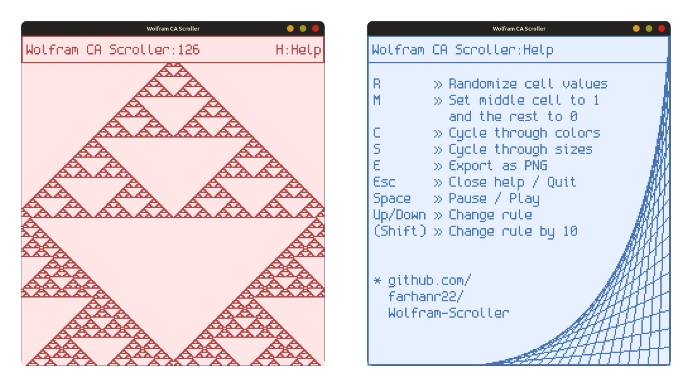

# Wolfram CA Scroller


A simple, interactive Wolfram Cellular Automata [[1]](https://mathworld.wolfram.com/ElementaryCellularAutomaton.html) [[2]](https://en.wikipedia.org/wiki/Elementary_cellular_automaton) viewer written in C. Created to explore graphics programming, tinker with cellular automata and to learn to set up a cross platform build system.


<p align="center">
  
</p>


### Download

Binaries for Windows and Linux are available for download on the [Releases](https://github.com/farhanr22/Wolfram-Scroller/releases) page, and below:
- [Windows `.exe`](https://github.com/farhanr22/Wolfram-Scroller/releases/latest/download/wscroller.exe)
- [Linux executable](https://github.com/farhanr22/Wolfram-Scroller/releases/latest/download/wscroller)

### Features

* View any of the 256 elementary Wolfram cellular automata rules, scrolling infinitely.
* Pause/resume the simulation.
* Interactively change the rule, grid size, and color scheme.
* Start from a single middle cell or a randomized first generation.
* Export the current view as a PNG image.


### Controls

| Key / Combination   | Action                                         |
|---------------------|------------------------------------------------|
| **Up / Down Arrows** | Change the rule by 1                          |
| **Shift + Up/Down** | Change the rule by 10                         |
| **Space**           | Pause or resume the simulation                |
| **S**               | Cycle through grid sizes (Small, Medium, Large) |
| **C**               | Cycle through color themes                    |
| **M**               | Reset the grid to a single "middle" cell       |
| **R**               | Reset the grid with a randomized first line    |
| **E**               | Export the current grid view to a `.png` file  |
| **H**               | Show/hide the help screen                      |
| **Esc**             | Close the help screen or quit the application  |

---

### Building from Source


The system dependencies required are standard C graphics development tools and libraries.  
The graphics library and font are included directly in the source.

**Dependencies on Debian / Ubuntu :**
```bash
sudo apt install build-essential libgl1-mesa-dev libglu1-mesa-dev libx11-dev
```

**Windows :** Has been tested with [**w64devkit**](https://github.com/skeeto/w64devkit), you may use any suitable C compiler suite. Make sure the compiler's `bin` folder is added to your `PATH`.


**Build :** Once the dependencies are installed, run `make` in the project directory. This will create the executable file named `wscroller` (or `wscroller.exe` on Windows).

The font is embedded directly into the executable to avoid external dependencies. This is done by converting the [`font/font.png`](font/font.png) file into a C header file ([`font/font.h`](font/font.h)). It can be (re)generated using the included [Python script](font/convert.py).


### Credits

This project is built on top of a delightful graphics library, [**TIGR**](https://github.com/erkkah/tigr).

The font used is [**Spleen**](https://github.com/fcambus/spleen), specifically the `6x12` size. 

### License

This project is licensed under the [MIT License](LICENSE).


